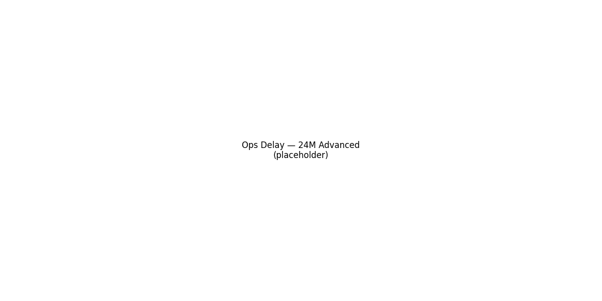
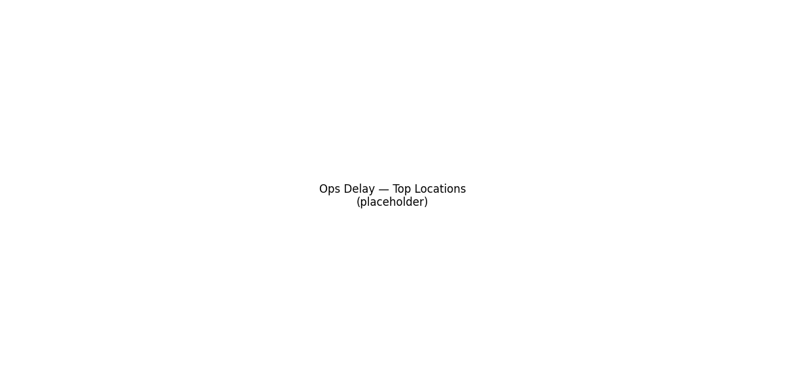
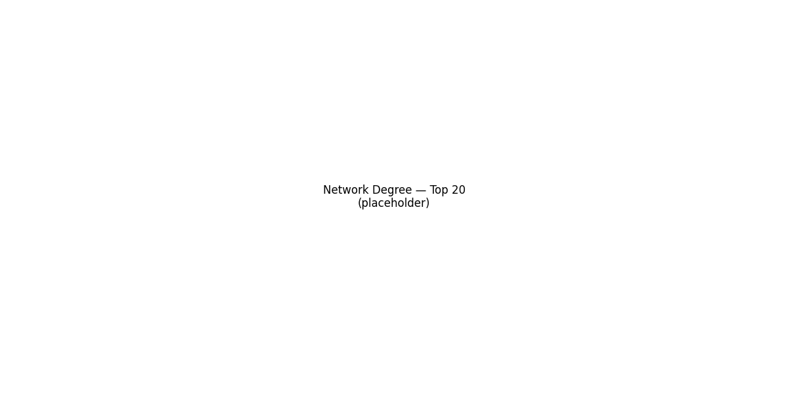

# Visual Insights — Executive Demo

> Halaman ini menampilkan highlight visual yang langsung “bicara” ke use case Emirates.

## Ops Delay — 24 Bulan (Anomali & Moving Average)

### Interaktif (zoom/hover)

## KPI Ringkas

## Top Locations (Mini Panels)

## Network Strength — Top-20 Airport Degree

---

### Navigasi dataset
- [Euro ATFM Timeseries](../pages/euro_atfm_timeseries.md) · [By Location](../pages/euro_atfm_by_location.md)  
- [Airport Degree](../pages/airport_degree.md) · [Top OD Pairs](../pages/top_od_pairs.md)
