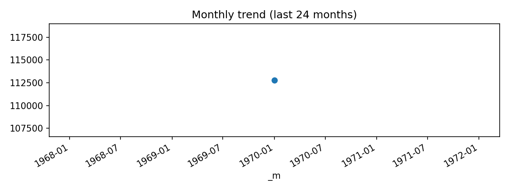

# Airport Degree (Last 24 months: 1970-01 … 1970-01)

**Source CSV:** [airport_degree.csv](../publish/airport_degree.csv)



## Summary

- **Rows (preview scope):** 1 of total 3,425
- **Columns:** 4

## Schema

```
- iata: object
- deg_out: datetime64[ns]
- deg_in: int64
- deg_total: int64
```

## Preview

| iata   | deg_out                       |   deg_in |   deg_total |
|:-------|:------------------------------|---------:|------------:|
| FRA    | 1970-01-01 00:00:00.000000239 |      238 |         477 |
| CDG    | 1970-01-01 00:00:00.000000237 |      233 |         470 |
| AMS    | 1970-01-01 00:00:00.000000232 |      231 |         463 |
| IST    | 1970-01-01 00:00:00.000000227 |      230 |         457 |
| ATL    | 1970-01-01 00:00:00.000000217 |      216 |         433 |
| PEK    | 1970-01-01 00:00:00.000000206 |      206 |         412 |
| ORD    | 1970-01-01 00:00:00.000000206 |      203 |         409 |
| MUC    | 1970-01-01 00:00:00.000000191 |      189 |         380 |
| DME    | 1970-01-01 00:00:00.000000189 |      189 |         378 |
| DFW    | 1970-01-01 00:00:00.000000187 |      185 |         372 |
| DXB    | 1970-01-01 00:00:00.000000188 |      182 |         370 |
| LHR    | 1970-01-01 00:00:00.000000171 |      171 |         342 |
| DEN    | 1970-01-01 00:00:00.000000169 |      168 |         337 |
| IAH    | 1970-01-01 00:00:00.000000169 |      168 |         337 |
| LGW    | 1970-01-01 00:00:00.000000165 |      165 |         330 |
| BCN    | 1970-01-01 00:00:00.000000163 |      163 |         326 |
| JFK    | 1970-01-01 00:00:00.000000162 |      160 |         322 |
| FCO    | 1970-01-01 00:00:00.000000157 |      159 |         316 |
| MAD    | 1970-01-01 00:00:00.000000158 |      156 |         314 |
| STN    | 1970-01-01 00:00:00.000000153 |      152 |         305 |
