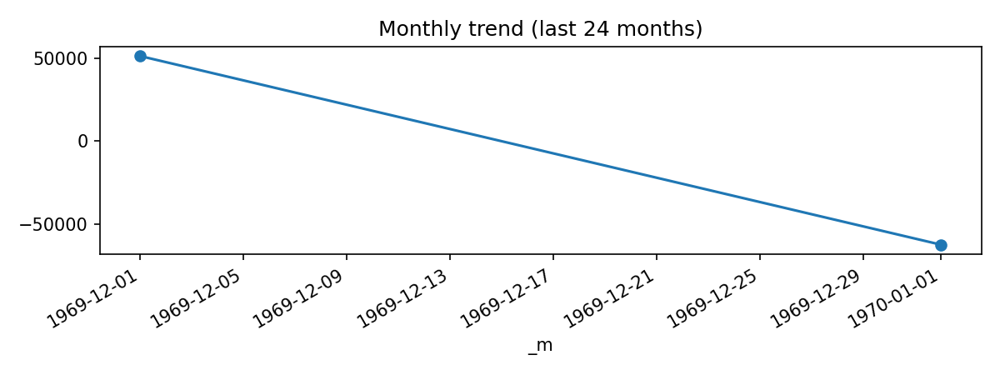

# Dim Airport Clean (Last 24 months: 1969-12 … 1970-01)

**Source CSV:** [dim_airport_clean.csv](../publish/dim_airport_clean.csv)



## Summary

- **Rows (preview scope):** 2 of total 6,072
- **Columns:** 8

## Schema

```
- iata: object
- icao: object
- airport_name: object
- city: object
- country: object
- lat: datetime64[ns]
- lon: float64
- tz: object
```

## Preview

| iata   | icao   | airport_name                                | city           | country          | lat                           |      lon | tz                   |
|:-------|:-------|:--------------------------------------------|:---------------|:-----------------|:------------------------------|---------:|:---------------------|
| GKA    | AYGA   | Goroka Airport                              | Goroka         | Papua New Guinea | 1969-12-31 23:59:59.999999994 | 145.392  | Pacific/Port_Moresby |
| MAG    | AYMD   | Madang Airport                              | Madang         | Papua New Guinea | 1969-12-31 23:59:59.999999995 | 145.789  | Pacific/Port_Moresby |
| HGU    | AYMH   | Mount Hagen Kagamuga Airport                | Mount Hagen    | Papua New Guinea | 1969-12-31 23:59:59.999999995 | 144.296  | Pacific/Port_Moresby |
| LAE    | AYNZ   | Nadzab Airport                              | Nadzab         | Papua New Guinea | 1969-12-31 23:59:59.999999994 | 146.726  | Pacific/Port_Moresby |
| POM    | AYPY   | Port Moresby Jacksons International Airport | Port Moresby   | Papua New Guinea | 1969-12-31 23:59:59.999999991 | 147.22   | Pacific/Port_Moresby |
| WWK    | AYWK   | Wewak International Airport                 | Wewak          | Papua New Guinea | 1969-12-31 23:59:59.999999997 | 143.669  | Pacific/Port_Moresby |
| UAK    | BGBW   | Narsarsuaq Airport                          | Narssarssuaq   | Greenland        | 1970-01-01 00:00:00.000000061 | -45.426  | America/Godthab      |
| GOH    | BGGH   | Godthaab / Nuuk Airport                     | Godthaab       | Greenland        | 1970-01-01 00:00:00.000000064 | -51.6781 | America/Godthab      |
| SFJ    | BGSF   | Kangerlussuaq Airport                       | Sondrestrom    | Greenland        | 1970-01-01 00:00:00.000000067 | -50.7116 | America/Godthab      |
| THU    | BGTL   | Thule Air Base                              | Thule          | Greenland        | 1970-01-01 00:00:00.000000076 | -68.7032 | America/Thule        |
| AEY    | BIAR   | Akureyri Airport                            | Akureyri       | Iceland          | 1970-01-01 00:00:00.000000065 | -18.0727 | Atlantic/Reykjavik   |
| EGS    | BIEG   | Egilsstaðir Airport                         | Egilsstadir    | Iceland          | 1970-01-01 00:00:00.000000065 | -14.4014 | Atlantic/Reykjavik   |
| HFN    | BIHN   | Hornafjörður Airport                        | Hofn           | Iceland          | 1970-01-01 00:00:00.000000064 | -15.2272 | Atlantic/Reykjavik   |
| HZK    | BIHU   | Húsavík Airport                             | Husavik        | Iceland          | 1970-01-01 00:00:00.000000065 | -17.426  | Atlantic/Reykjavik   |
| IFJ    | BIIS   | Ísafjörður Airport                          | Isafjordur     | Iceland          | 1970-01-01 00:00:00.000000066 | -23.1353 | Atlantic/Reykjavik   |
| KEF    | BIKF   | Keflavik International Airport              | Keflavik       | Iceland          | 1970-01-01 00:00:00.000000063 | -22.6056 | Atlantic/Reykjavik   |
| PFJ    | BIPA   | Patreksfjörður Airport                      | Patreksfjordur | Iceland          | 1970-01-01 00:00:00.000000065 | -23.965  | Atlantic/Reykjavik   |
| RKV    | BIRK   | Reykjavik Airport                           | Reykjavik      | Iceland          | 1970-01-01 00:00:00.000000064 | -21.9406 | Atlantic/Reykjavik   |
| SIJ    | BISI   | Siglufjörður Airport                        | Siglufjordur   | Iceland          | 1970-01-01 00:00:00.000000066 | -18.9167 | Atlantic/Reykjavik   |
| VEY    | BIVM   | Vestmannaeyjar Airport                      | Vestmannaeyjar | Iceland          | 1970-01-01 00:00:00.000000063 | -20.2789 | Atlantic/Reykjavik   |
