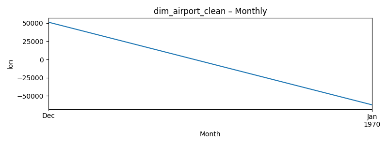

# Dim Airport Clean (Last 24 months: 1969-12 … 1970-01)

**Source CSV:** [dim_airport_clean.csv](../publish/dim_airport_clean.csv)  
**Rows:** 6,072  
**Columns:** iata, icao, airport_name, city, country, lat, lon, tz



### Schema

```
- iata: object
- icao: object
- airport_name: object
- city: object
- country: object
- lat: datetime64[ns]
- lon: float64
- tz: object
```

### Preview

_Showing first 50 of 6,072 rows._

| iata | icao | airport_name | city | country | lat | lon | tz |
|---|---|---|---|---|---|---|---|
| GKA | AYGA | Goroka Airport | Goroka | Papua New Guinea | 1969-12-31 | 145.391998291 | Pacific/Port_Moresby |
| MAG | AYMD | Madang Airport | Madang | Papua New Guinea | 1969-12-31 | 145.789001465 | Pacific/Port_Moresby |
| HGU | AYMH | Mount Hagen Kagamuga Airport | Mount Hagen | Papua New Guinea | 1969-12-31 | 144.29600524902344 | Pacific/Port_Moresby |
| LAE | AYNZ | Nadzab Airport | Nadzab | Papua New Guinea | 1969-12-31 | 146.725977 | Pacific/Port_Moresby |
| POM | AYPY | Port Moresby Jacksons International Airport | Port Moresby | Papua New Guinea | 1969-12-31 | 147.22000122070312 | Pacific/Port_Moresby |
| WWK | AYWK | Wewak International Airport | Wewak | Papua New Guinea | 1969-12-31 | 143.669006348 | Pacific/Port_Moresby |
| UAK | BGBW | Narsarsuaq Airport | Narssarssuaq | Greenland | 1970-01-01 | -45.4259986877 | America/Godthab |
| GOH | BGGH | Godthaab / Nuuk Airport | Godthaab | Greenland | 1970-01-01 | -51.6781005859 | America/Godthab |
| SFJ | BGSF | Kangerlussuaq Airport | Sondrestrom | Greenland | 1970-01-01 | -50.7116031647 | America/Godthab |
| THU | BGTL | Thule Air Base | Thule | Greenland | 1970-01-01 | -68.7032012939 | America/Thule |
| AEY | BIAR | Akureyri Airport | Akureyri | Iceland | 1970-01-01 | -18.07270050048828 | Atlantic/Reykjavik |
| EGS | BIEG | Egilsstaðir Airport | Egilsstadir | Iceland | 1970-01-01 | -14.401399612426758 | Atlantic/Reykjavik |
| HFN | BIHN | Hornafjörður Airport | Hofn | Iceland | 1970-01-01 | -15.2272 | Atlantic/Reykjavik |
| HZK | BIHU | Húsavík Airport | Husavik | Iceland | 1970-01-01 | -17.426001 | Atlantic/Reykjavik |
| IFJ | BIIS | Ísafjörður Airport | Isafjordur | Iceland | 1970-01-01 | -23.135299682617188 | Atlantic/Reykjavik |
| KEF | BIKF | Keflavik International Airport | Keflavik | Iceland | 1970-01-01 | -22.605600357056 | Atlantic/Reykjavik |
| PFJ | BIPA | Patreksfjörður Airport | Patreksfjordur | Iceland | 1970-01-01 | -23.965 | Atlantic/Reykjavik |
| RKV | BIRK | Reykjavik Airport | Reykjavik | Iceland | 1970-01-01 | -21.9405994415 | Atlantic/Reykjavik |
| SIJ | BISI | Siglufjörður Airport | Siglufjordur | Iceland | 1970-01-01 | -18.9167 | Atlantic/Reykjavik |
| VEY | BIVM | Vestmannaeyjar Airport | Vestmannaeyjar | Iceland | 1970-01-01 | -20.27890014648437 | Atlantic/Reykjavik |
| YAM | CYAM | Sault Ste Marie Airport | Sault Sainte Marie | Canada | 1970-01-01 | -84.5093994140625 | America/Toronto |
| YAY | CYAY | St. Anthony Airport | St. Anthony | Canada | 1970-01-01 | -56.083099365200006 | America/St_Johns |
| YAZ | CYAZ | Tofino / Long Beach Airport | Tofino | Canada | 1970-01-01 | -125.775583 | America/Vancouver |
| YBB | CYBB | Kugaaruk Airport | Pelly Bay | Canada | 1970-01-01 | -89.808098 | America/Edmonton |
| YBC | CYBC | Baie Comeau Airport | Baie Comeau | Canada | 1970-01-01 | -68.20439910888672 | America/Toronto |
| YBG | CYBG | CFB Bagotville | Bagotville | Canada | 1970-01-01 | -70.99639892578125 | America/Toronto |
| YBK | CYBK | Baker Lake Airport | Baker Lake | Canada | 1970-01-01 | -96.077796936 | America/Winnipeg |
| YBL | CYBL | Campbell River Airport | Campbell River | Canada | 1970-01-01 | -125.27100372314452 | America/Vancouver |
| YBR | CYBR | Brandon Municipal Airport | Brandon | Canada | 1970-01-01 | -99.951897 | America/Winnipeg |
| YCB | CYCB | Cambridge Bay Airport | Cambridge Bay | Canada | 1970-01-01 | -105.138000488 | America/Edmonton |
| YCD | CYCD | Nanaimo Airport | Nanaimo | Canada | 1970-01-01 | -123.869862556 | America/Vancouver |
| YCG | CYCG | Castlegar/West Kootenay Regional Airport | Castlegar | Canada | 1970-01-01 | -117.632003784 | America/Vancouver |
| YCH | CYCH | Miramichi Airport | Chatham | Canada | 1970-01-01 | -65.449203 | America/Halifax |
| YCL | CYCL | Charlo Airport | Charlo | Canada | 1970-01-01 | -66.330299 | America/Halifax |
| YCO | CYCO | Kugluktuk Airport | Coppermine | Canada | 1970-01-01 | -115.143997 | America/Edmonton |
| YCT | CYCT | Coronation Airport | Coronation | Canada | 1970-01-01 | -111.444999695 | America/Edmonton |
| YCW | CYCW | Chilliwack Airport | Chilliwack | Canada | 1970-01-01 | -121.939002991 | America/Vancouver |
| YCY | CYCY | Clyde River Airport | Clyde River | Canada | 1970-01-01 | -68.5167007446 | America/Toronto |
| YZS | CYZS | Coral Harbour Airport | Coral Harbour | Canada | 1970-01-01 | -83.3593978882 | America/Coral_Harbour |
| YDA | CYDA | Dawson City Airport | Dawson | Canada | 1970-01-01 | -139.1280059814453 | America/Vancouver |
| YDB | CYDB | Burwash Airport | Burwash | Canada | 1970-01-01 | -139.04100036621094 | America/Vancouver |
| YDF | CYDF | Deer Lake Airport | Deer Lake | Canada | 1970-01-01 | -57.39139938354492 | America/St_Johns |
| YDL | CYDL | Dease Lake Airport | Dease Lake | Canada | 1970-01-01 | -130.031997681 | America/Vancouver |
| YDN | CYDN | Dauphin Barker Airport | Dauphin | Canada | 1970-01-01 | -100.052001953125 | America/Winnipeg |
| YDQ | CYDQ | Dawson Creek Airport | Dawson Creek | Canada | 1970-01-01 | -120.18299865722656 | America/Dawson_Creek |
| YEG | CYEG | Edmonton International Airport | Edmonton | Canada | 1970-01-01 | -113.580001831 | America/Edmonton |
| YEK | CYEK | Arviat Airport | Eskimo Point | Canada | 1970-01-01 | -94.0708007812 | America/Winnipeg |
| YEN | CYEN | Estevan Airport | Estevan | Canada | 1970-01-01 | -102.966003418 | America/Regina |
| YET | CYET | Edson Airport | Edson | Canada | 1970-01-01 | -116.464996338 | America/Edmonton |
| YEU | CYEU | Eureka Airport | Eureka | Canada | 1970-01-01 | -85.814201355 | America/Winnipeg |

