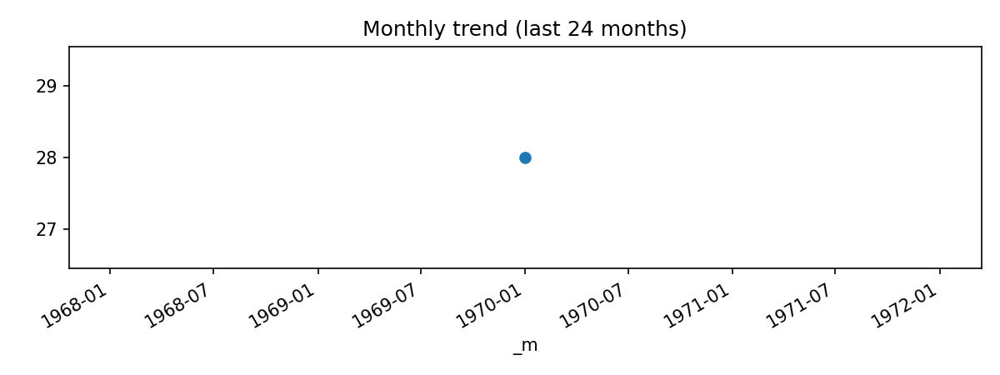

# Euro Atfm By Location (Last 24 months: 1970-01 … 1970-01)

**Source CSV:** [euro_atfm_by_location.csv](../publish/euro_atfm_by_location.csv)



## Summary

- **Rows (preview scope):** 1 of total 28
- **Columns:** 2

## Schema

```
- location: object
- delay_minutes: datetime64[ns]
```

## Preview

| location                        | delay_minutes                 |
|:--------------------------------|:------------------------------|
| HungaroControl (EC)             | 1970-01-01 00:00:00.000000002 |
| Croatia Control                 | 1970-01-01 00:00:00.000000001 |
| DFS + MUAC-DE                   | 1970-01-01 00:00:00.000000001 |
| DSNA                            | 1970-01-01 00:00:00.000000001 |
| ENAIRE                          | 1970-01-01 00:00:00           |
| HASP                            | 1970-01-01 00:00:00           |
| ENAV                            | 1970-01-01 00:00:00           |
| Austro Control                  | 1970-01-01 00:00:00           |
| NAV Portugal (Continental)      | 1970-01-01 00:00:00           |
| Skyguide                        | 1970-01-01 00:00:00           |
| PANSA                           | 1970-01-01 00:00:00           |
| ROMATSA                         | 1970-01-01 00:00:00           |
| LPS SR                          | 1970-01-01 00:00:00           |
| Belgium-Lux. + MUAC  BE-LU      | 1970-01-01 00:00:00           |
| BULATSA                         | 1970-01-01 00:00:00           |
| ANS CR                          | 1970-01-01 00:00:00           |
| NAVIAIR                         | 1970-01-01 00:00:00           |
| Malta Air Traffic Services Ltd. | 1970-01-01 00:00:00           |
| SE Oro Navigacija               | 1970-01-01 00:00:00           |
| EANS                            | 1970-01-01 00:00:00           |
