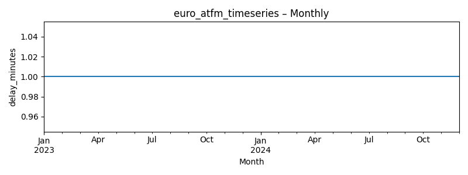

# Euro Atfm Timeseries (Last 24 months: 2022-12 … 2024-12)

**Source CSV:** [euro_atfm_timeseries.csv](../publish/euro_atfm_timeseries.csv)  
**Rows:** 25  
**Columns:** period_start, delay_minutes



### Schema

```
- period_start: datetime64[ns]
- delay_minutes: float64
```

### Preview

| period_start | delay_minutes |
|---|---|
| 2022-12-01 | 1.0 |
| 2023-01-01 | 1.0 |
| 2023-02-01 | 1.0 |
| 2023-03-01 | 1.0 |
| 2023-04-01 | 1.0 |
| 2023-05-01 | 1.0 |
| 2023-06-01 | 1.0 |
| 2023-07-01 | 1.0 |
| 2023-08-01 | 1.0 |
| 2023-09-01 | 1.0 |
| 2023-10-01 | 1.0 |
| 2023-11-01 | 1.0 |
| 2023-12-01 | 1.0 |
| 2024-01-01 | 1.0 |
| 2024-02-01 | 1.0 |
| 2024-03-01 | 1.0 |
| 2024-04-01 | 1.0 |
| 2024-05-01 | 1.0 |
| 2024-06-01 | 1.0 |
| 2024-07-01 | 1.0 |
| 2024-08-01 | 1.0 |
| 2024-09-01 | 1.0 |
| 2024-10-01 | 1.0 |
| 2024-11-01 | 1.0 |
| 2024-12-01 | 1.0 |

