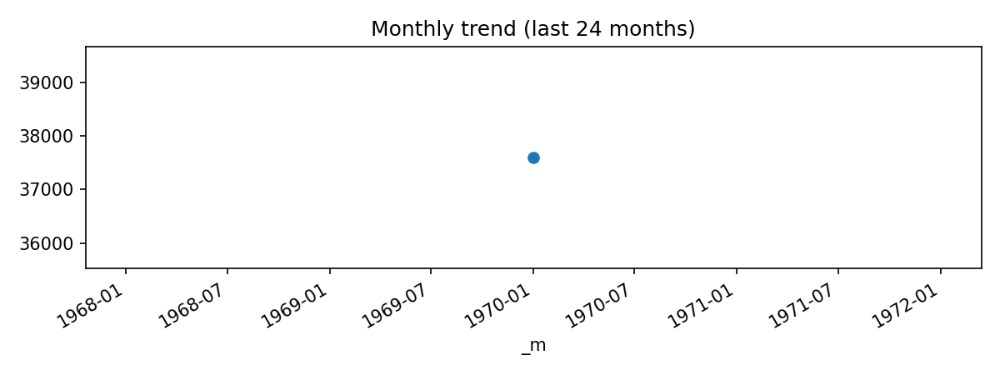

# Route Counts (Last 24 months: 1970-01 … 1970-01)

**Source CSV:** [route_counts.csv](../publish/route_counts.csv)  
**Rows:** 37,595  
**Columns:** src_iata, dst_iata, num_routes



### Schema

```
- src_iata: object
- dst_iata: object
- num_routes: datetime64[ns]
```

### Preview

_Showing first 50 of 37,595 rows._

| src_iata | dst_iata | num_routes |
|---|---|---|
| EGO | KZN | 1970-01-01 |
| LED | KZN | 1970-01-01 |
| IKT | BTK | 1970-01-01 |
| IKT | ULK | 1970-01-01 |
| IQT | TPP | 1970-01-01 |
| PEM | CUZ | 1970-01-01 |
| OUA | BOY | 1970-01-01 |
| ARN | KSD | 1970-01-01 |
| ARN | MHQ | 1970-01-01 |
| GEV | ARN | 1970-01-01 |
| GEV | KRF | 1970-01-01 |
| OER | ARN | 1970-01-01 |
| VBY | ARN | 1970-01-01 |
| KKB | SYB | 1970-01-01 |
| SYB | KPR | 1970-01-01 |
| LGP | MNL | 1970-01-01 |
| BSB | OPS | 1970-01-01 |
| GYN | PMW | 1970-01-01 |
| UDI | RAO | 1970-01-01 |
| CGA | KTN | 1970-01-01 |
| LGW | FNA | 1970-01-01 |
| LOS | DKR | 1970-01-01 |
| OXB | DKR | 1970-01-01 |
| YGL | YGW | 1970-01-01 |
| YKG | YQC | 1970-01-01 |
| HKG | SIN | 1970-01-01 |
| PNH | SIN | 1970-01-01 |
| SIN | PNH | 1970-01-01 |
| TPE | KIX | 1970-01-01 |
| DRS | ZRH | 1970-01-01 |
| ATL | PIB | 1970-01-01 |
| MCO | FLL | 1970-01-01 |
| MHH | MCO | 1970-01-01 |
| CMN | BRU | 1970-01-01 |
| PMI | NDR | 1970-01-01 |
| TNG | AMS | 1970-01-01 |
| TNG | LGW | 1970-01-01 |
| BON | CUR | 1970-01-01 |
| DME | SKD | 1970-01-01 |
| FDF | SDQ | 1970-01-01 |
| PTP | DOM | 1970-01-01 |
| PTP | FDF | 1970-01-01 |
| SBH | PTP | 1970-01-01 |
| CGQ | NKG | 1970-01-01 |
| CKG | HKT | 1970-01-01 |
| CKG | LXA | 1970-01-01 |
| CKG | SZX | 1970-01-01 |
| CTU | DSN | 1970-01-01 |
| CTU | LJG | 1970-01-01 |
| CTU | PVG | 1970-01-01 |

