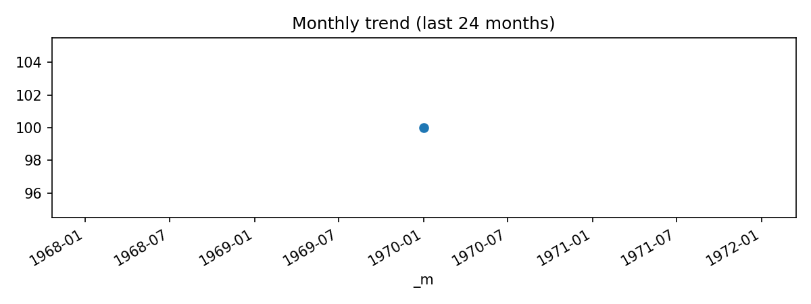

# Top Od Pairs (Last 24 months: 1970-01 … 1970-01)

**Source CSV:** [top_od_pairs.csv](../publish/top_od_pairs.csv)  
**Rows:** 100  
**Columns:** src_iata, dst_iata, num_routes



### Schema

```
- src_iata: object
- dst_iata: object
- num_routes: datetime64[ns]
```

### Preview

| src_iata | dst_iata | num_routes |
|---|---|---|
| ORD | ATL | 1970-01-01 |
| ATL | ORD | 1970-01-01 |
| HKT | BKK | 1970-01-01 |
| ORD | MSY | 1970-01-01 |
| ATL | MIA | 1970-01-01 |
| AUH | MCT | 1970-01-01 |
| BKK | HKG | 1970-01-01 |
| CAN | HGH | 1970-01-01 |
| DOH | BAH | 1970-01-01 |
| HKG | BKK | 1970-01-01 |
| JFK | LHR | 1970-01-01 |
| LHR | JFK | 1970-01-01 |
| MIA | ATL | 1970-01-01 |
| ATL | DEN | 1970-01-01 |
| ATL | DFW | 1970-01-01 |
| CDG | JFK | 1970-01-01 |
| CNX | BKK | 1970-01-01 |
| DEN | ATL | 1970-01-01 |
| HRE | LUN | 1970-01-01 |
| JFK | CDG | 1970-01-01 |
| JFK | MSY | 1970-01-01 |
| KGL | EBB | 1970-01-01 |
| LAX | LHR | 1970-01-01 |
| LHR | LAX | 1970-01-01 |
| MCT | AUH | 1970-01-01 |
| MSY | JFK | 1970-01-01 |
| SFO | ATL | 1970-01-01 |
| SYD | AKL | 1970-01-01 |
| AKL | SYD | 1970-01-01 |
| ATL | JFK | 1970-01-01 |
| ATL | LAX | 1970-01-01 |
| BAH | DOH | 1970-01-01 |
| BKK | CNX | 1970-01-01 |
| BKK | HKT | 1970-01-01 |
| BKK | ICN | 1970-01-01 |
| BKK | SIN | 1970-01-01 |
| CDG | ORD | 1970-01-01 |
| CGK | KUL | 1970-01-01 |
| CGK | SIN | 1970-01-01 |
| CGO | HGH | 1970-01-01 |
| CKG | XIY | 1970-01-01 |
| CMB | MLE | 1970-01-01 |
| DFW | ATL | 1970-01-01 |
| DLC | HGH | 1970-01-01 |
| DPS | SIN | 1970-01-01 |
| HGH | CAN | 1970-01-01 |
| HGH | CGO | 1970-01-01 |
| HGH | DLC | 1970-01-01 |
| HKG | ICN | 1970-01-01 |
| ICN | BKK | 1970-01-01 |
| ICN | HKG | 1970-01-01 |
| ICN | NRT | 1970-01-01 |
| JFK | MXP | 1970-01-01 |
| JHG | KMG | 1970-01-01 |
| KMG | JHG | 1970-01-01 |
| KUL | CGK | 1970-01-01 |
| KUL | SIN | 1970-01-01 |
| LHR | SFO | 1970-01-01 |
| MLE | CMB | 1970-01-01 |
| MXP | JFK | 1970-01-01 |
| NRT | ICN | 1970-01-01 |
| NRT | TPE | 1970-01-01 |
| ORD | CDG | 1970-01-01 |
| SFO | LHR | 1970-01-01 |
| SIN | CGK | 1970-01-01 |
| SIN | DPS | 1970-01-01 |
| SIN | KUL | 1970-01-01 |
| TPE | NRT | 1970-01-01 |
| XIY | CKG | 1970-01-01 |
| ACE | LGW | 1970-01-01 |
| ATL | CUN | 1970-01-01 |
| ATL | IAD | 1970-01-01 |
| ATL | IAH | 1970-01-01 |
| ATL | IND | 1970-01-01 |
| ATL | JAX | 1970-01-01 |
| ATL | MSY | 1970-01-01 |
| ATL | PHL | 1970-01-01 |
| ATL | PHX | 1970-01-01 |
| ATL | RDU | 1970-01-01 |
| ATL | SFO | 1970-01-01 |
| BCN | JFK | 1970-01-01 |
| BKK | KUL | 1970-01-01 |
| BNE | SIN | 1970-01-01 |
| BOS | LHR | 1970-01-01 |
| CDG | MIA | 1970-01-01 |
| CGO | URC | 1970-01-01 |
| CKG | KMG | 1970-01-01 |
| CNS | BNE | 1970-01-01 |
| CPT | JNB | 1970-01-01 |
| CTU | HGH | 1970-01-01 |
| CTU | KMG | 1970-01-01 |
| CUN | ATL | 1970-01-01 |
| DFW | FRA | 1970-01-01 |
| DUB | JFK | 1970-01-01 |
| FRA | DFW | 1970-01-01 |
| HGH | CTU | 1970-01-01 |
| HGH | TAO | 1970-01-01 |
| HNL | LAX | 1970-01-01 |
| IAD | ATL | 1970-01-01 |
| IAH | ATL | 1970-01-01 |

